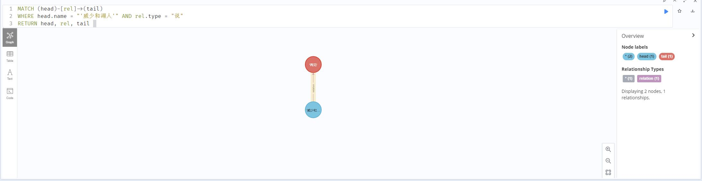

### neo4j查询效果（python）

neo4j（python）查询尾实体

neo4j（python）查询头实体或关系

### neo4j图谱查询

neo4j查询尾实体

neo4j查询头实体

neo4j查询关系

### Transe查询

transe查询尾实体

transe查询头实体

transe查询关系

### Transh查询

transh查询尾实体

transh查询头实体

transh查询关系

